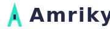
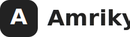

# Mohamed Abdelaziz – Personal Portfolio Website

## Info

> **Fill out this section with your real personal details before publishing!**

- **Name:** Mohamed H Abdelaziz
- **Born:** July 10, 1999 (26 years old)
- **Tagline:** Cybersecurity Engineer | AI Innovator
- **Profile Image:** `profile.jpg`
- **Location:** Cairo, Egypt (Egyptian-American)
- **Languages:** Arabic, English
- **Email:** <amrikyy@email.com>
- **Phone (Call & WhatsApp):** +20-109-422-8044
- **WhatsApp (only):** +1-770-616-0211
- **GitHub Development Program Member**
- **Social Links:**
  - [LinkedIn](https://www.linkedin.com/in/amrikyy)
  - [GitHub](https://github.com/mohamed-abdelaziz710)
  - [Facebook](https://web.facebook.com/Hamood.Amriky0/)
  - [Instagram](https://www.instagram.com/amrikyy?igsh=bzhlOHRycTN4bDAz&utm_source=qr)
  - [TikTok](https://www.tiktok.com/@moecrypto710?_t=ZT-8wbeZ0H9A1z&_r=1)
  - [Snapchat](https://snapchat.com/t/M9sQbCZu)

### Skills

- Web Development: HTML, CSS, React, Angular
- Web Design: HTML, CSS, Sketch, Figma
- chatGPT
- Google Drive
- Brainstorming
- Build AI agents
- Python
- Azure
- Firebase
- Amadeus Selling Platform

### Highlights & Achievements

- Built a landing page project for charity: water
- Member of Blackroom Talent Community
- Cisco Certified in Cybersecurity
- Worked as a travel agent for 2 years (Amadeus Selling Platform experience)
- Currently writing a book titled "CodeX"
- Participant in the Global Career Program with OpenAI, L'Oréal, charity: water, Intel, and Google

### Education

- Graduated 2017, El Shaheen High School, Kuwait City
- Graduated 2021, Chattahoochee Technical College, Marietta, GA, USA
- Will graduate May 2026, Kennesaw State University (Cybersecurity Engineering)

---

## Overview

This project is a modern, high-impact personal portfolio website for Mohamed Abdelaziz, Cybersecurity Engineer & AI Innovator. The site is designed to showcase skills, credentials, and contact information with a focus on:

- Enhanced user experience (UX)
- Sophisticated animations and interactivity
- Mobile-first responsive design
- Integration of a custom chatbot
- Use of modern technologies (React, Next.js, Tailwind CSS, GSAP/Framer Motion)

## Project Highlights

- **Custom Spaceship UI/UX Theme:** Unique, visually engaging design with animated elements and a futuristic aesthetic.
- **Section Structure:**
  - Header with navigation and top-aligned social media icons
  - About, Badges, Skills, and Contact sections, all centered and visually distinct
  - Modern, animated contact buttons and social links
- **Accessibility & Performance:**
  - Mobile-first layout
  - Fast load times and optimized assets
  - Accessible color contrast and keyboard navigation
- **Chatbot Integration:**
  - Ready for custom chatbot widget integration

## Redesign Process

1. **Audit:** Reviewed the previous site for UI/UX, animation, and technology gaps.
2. **Template Research:** Compared top portfolio templates (Folio, DeveloperFolio, Nim) for animation, stack, and customization.
3. **Recommendation:** Chose the Folio template (Next.js, Tailwind, GSAP) for its animation power and modern stack.
4. **Implementation Plan:**
   - Mobile-first, modular section design
   - GSAP/Framer Motion for animations
   - Easy content integration and future updates
   - Chatbot and SEO optimization
5. **Alternatives:** Pablo Stanley's Portfolio v2 and Chetan Verma's 3D Portfolio suggested for advanced animation needs.

## How to Use / Run Locally

1. Clone the repository:

   ```bash
   git clone https://github.com/mohamed-abdelaziz710/My-Website.git
   cd My-Website
   ```

2. Open `index.html` in your browser for the static version.
3. For advanced features (React/Next.js/GSAP), follow the redesign plan in `redesign_plan.md`.

## Key Files

- `index.html` – Main site structure and content
- `style.css` – Custom Spaceship UI/UX theme styles
- `script.js` – Section reveal and interactivity
- `profile.jpg` – Profile image

## Documentation & Planning

- `website_audit.md` – UI/UX audit findings
- `template_comparison.md` – Template feature comparison
- `template_recommendation.md` – Justification for template choice
- `redesign_plan.md` – Step-by-step redesign and implementation plan
- `alternative_templates.md` – Other template suggestions

## Next Steps

1. Review the planning documents above.
2. Confirm the template and redesign plan.
3. Proceed with development using the recommended stack and animation tools.

---

## Brand Style

**Font Family:**

- Exo 2, Roboto, sans-serif (primary)
- Roboto Mono, monospace (secondary)

**Writing Style:**

- Modern, concise, and professional
- Use clear section headings and bullet points
- Consistent capitalization and spacing
- Focus on clarity and visual hierarchy

**Box Model:**

- Use consistent padding and margin for all cards and containers
- Border radius: 8px–14px for cards and buttons
- Subtle box-shadow for depth
- Responsive grid for sections (skills, projects, badges)

**Brand Colors:**

- Neon Green: #21E6C1 (primary accent)
- Dark Gray: #10151F, #0A0F1A, #050A15 (backgrounds)
- White: #FFFFFF (main text)
- Black: #000000 (deep backgrounds)
- Neon Purple: #9A16E5 (secondary accent, for highlights)

These styles and colors are applied throughout the site for a cohesive, modern, and visually striking look.

For questions or collaboration, contact [amrikyy@gmail.com](mailto:amrikyy@gmail.com) or connect via LinkedIn.

---

## Logo & Favicon Usage

### Logo Variants

- **Full Logo (Wordmark + Icon):**
  - 
  - Usage: Main site header, social previews, large branding.
- **Logomark (Icon Only):**
  - 
  - Usage: Favicon, mobile nav, small badges, social avatars.
- **Monochrome Logo:**
  - 
  - Usage: Watermarks, print, dark/light backgrounds.

### Favicon Files

- `assets/icons/favicon-16x16.png` (standard browser tab)
- `assets/icons/favicon-32x32.png` (high-res tab)
- `assets/icons/favicon-96x96.png` (legacy/Win)
- `assets/icons/favicon-180x180.png` (Apple Touch icon)
- `assets/icons/favicon.ico` (multi-size, Windows/legacy)

**How to use:**
- All favicon and Apple Touch icon links are included in `<head>` of `index.html`:
  ```html
  <link rel="icon" type="image/png" sizes="16x16" href="assets/icons/favicon-16x16.png">
  <link rel="icon" type="image/png" sizes="32x32" href="assets/icons/favicon-32x32.png">
  <link rel="icon" type="image/png" sizes="96x96" href="assets/icons/favicon-96x96.png">
  <link rel="apple-touch-icon" sizes="180x180" href="assets/icons/favicon-180x180.png">
  <link rel="shortcut icon" href="assets/icons/favicon.ico" type="image/x-icon">
  ```

### Logo Usage Guidelines

- **Clear Space:**
  - Leave at least 1× the height of the logomark as clear space around all logo variants.
- **Minimum Size:**
  - Logomark: 16×16 px (for favicon)
  - Full logo: 120 px wide (for legibility)
- **Do not:**
  - Alter colors, stretch, or add effects to the logo.
  - Place on backgrounds with insufficient contrast.
